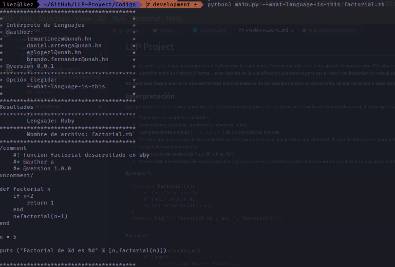

# LLP Project

* Usando Lark, haga un programa en Python con las siguientes funcionalidades de Lenguajes de Programación. El trabajo se debe realizar en equipos, distribuyendo las tareas para el trabajo entre todos los estudiantes del mismo para el cumplimiento en tiempo y forma. Hacer lectura de la Planificación Académica para ver el resto de lineamientos actualizados.

**En caso que llegue a ocurrir una entrevista a los miembros de los equipos sobre su desarrollo, se entrevistará a cada quien referente a la responsabilidad delegada entre los integrantes.**

**Interpretación**
--------------------
Que permita ejecutar léxica, semántica y sintácticamente (junto con sus diferentes niveles de manejo de error) el lenguaje Javascript limitado a los siguientes tipos de instrucción con sus elementos implícitos:
+ Comentarios simples o múltiples.
+ Asignaciones (cadenas, booleanos, números, nulo).
+ Comparaciones simples (==, <, >, <=, >=) de un condicional a la vez.
+ Declaración y ejecución de funciones de hasta 2 parámetros (sin parámetros por defecto). El tipo de dato de los parámetros es el mismo que el de las asignaciones.
+ Length de cualquier objeto.
+ Estructuras de control de flujo (if, while, for).
+ Generación de mensajes de salida (console.log y console.error). Deberá controlar el color de la salida en Linux para identificar el tipo de mensaje. Estos métodos nativamente permiten más de un parámetro.


### Ejemplo 1:

```javascript
function factorial(n){
    if (n==1) return 1;
    if (n<1) return 0;
    return n*factorial(n-1);
}
console.log("El factorial de 5 es: ", factorial(n));
```

Ejemplo 2:

```javascript
function isInStock(n,m){
    if (n<m){
        console.log("Hay en Stock!");
    }else{
        console.error("No hay en Stock!");
    }
}
isInStock();
```
**Demostración**
----------------

Que permita, en lugar de interpretar el lenguaje, imprimir la tabla de símbolos (de investigación ) generada internamente para la ejecución, con la información al final de la ejecución, con los datos tal y como se recomienda teóricamente en la literatura.

### Ejemplo de ejecución de instrucción (reemplazar el mensaje de bienvenida y datos relacionados, por el de su propio proyecto):

```bash
$ python3 main.py --symbols-table program.js
**********************************
* Intérprete de Lenguajes ILANG  *
* @author swd                    *
* @version 0.1                   *
* @date 2020/06/01               *
**********************************
**********************************
Tabla de símbolos:
**********************************
...
```

**Reconocimiento**
-------------

Que permita reconocer el lenguaje de programación de un software, mediante un parámetro. El reconocimiento deberá ser gramatical. Los lenguajes que debe comprender son Ruby, Bash. Las instrucciones a reconocer son:
* Comentarios simples o múltiples.
* Asignaciones (cadenas, booleanos, números, nulo).
* Declaración y ejecución de funciones.
* Estructuras de control de flujo (if, while, for).
* Generación de mensajes de salida.

### Ejemplo de ejecución de instrucción (reemplazar el mensaje de bienvenida y datos relacionados, por el de su propio proyecto):

```bash
$ python3 main.py --what-language-is-this program.rb

**********************************
* Intérprete de Lenguajes ILANG  *
* @author swd                    *
* @version 0.1                   *
* @date 2020/06/01               *
**********************************

**********************************
Lenguaje Detectado:
**********************************

Ruby

**********************************
Programa Leído:
**********************************

/comment
    # ! Método factorial.
    # * Permite calcular la multiplicación de n*(n-1)*(n-2)*...*(n-k), donde n-k >= 1
    # @author swd
    # @version 0.1
uncomment/

# Pruebe para que encuentre la solución en sus propias prácticas.

def factorial n
    if n<2
        return 1
    end
    n*factorial(n-1)
end

n = 5
puts ("El factorial en Ruby para '%d' es: %d" % [n,factorial(n)])
```

**Screenshots**


